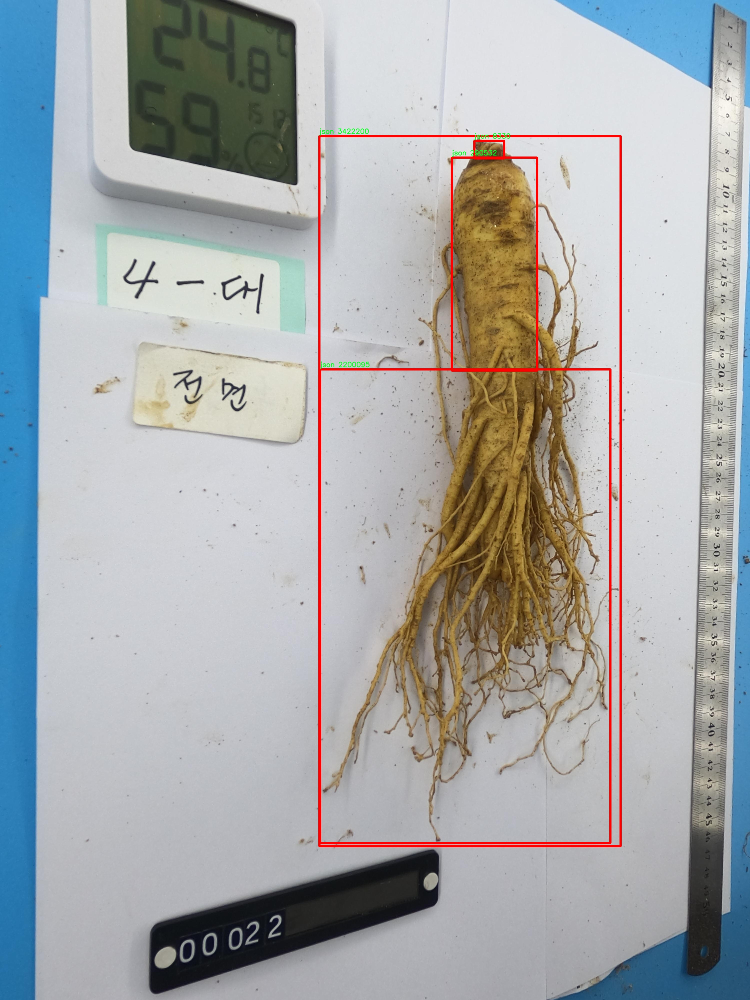

# 人参部位检测检测系统源码分享
 # [一条龙教学YOLOV8标注好的数据集一键训练_70+全套改进创新点发刊_Web前端展示]

### 1.研究背景与意义

项目参考[AAAI Association for the Advancement of Artificial Intelligence](https://gitee.com/qunshansj/projects)

项目来源[AACV Association for the Advancement of Computer Vision](https://gitee.com/qunmasj/projects)

研究背景与意义

人参作为一种重要的中药材，因其独特的药用价值和经济价值而受到广泛关注。近年来，随着人们对健康和自然疗法的重视，人参的需求量逐年增加。然而，传统的人参采集和分类方法往往依赖于人工经验，效率低下且容易出现误差。因此，开发一种高效、准确的人参部位检测系统显得尤为重要。基于深度学习的目标检测技术，尤其是YOLO（You Only Look Once）系列模型，因其在实时性和准确性方面的优越表现，成为解决这一问题的理想选择。

YOLOv8作为YOLO系列的最新版本，结合了更为先进的网络结构和优化算法，具备更强的特征提取能力和更快的推理速度。通过对YOLOv8的改进，我们可以针对人参的特征进行更为精准的检测和分类，从而提升人参部位的识别效率。这一改进不仅可以减少人工操作的误差，还能在大规模人参种植和采集过程中提供实时的监控和管理，促进人参产业的现代化和智能化发展。

在本研究中，我们将利用一个包含1900张图像的数据集进行模型训练和测试。该数据集专注于人参的部位检测，包含了丰富的样本和多样的拍摄角度，为模型的学习提供了良好的基础。通过对数据集的深入分析，我们可以提取出人参的关键特征，并将其应用于YOLOv8模型的训练中。这一过程不仅有助于提高模型的检测精度，还能为后续的实际应用提供可靠的数据支持。

此外，基于改进YOLOv8的人参部位检测系统的研究，具有重要的社会和经济意义。随着人参市场的不断扩大，如何保证人参的质量和来源成为了亟待解决的问题。通过自动化的检测系统，我们可以有效监控人参的生长环境和采集过程，确保其符合标准，提升消费者的信任度。同时，该系统的推广应用将推动相关技术的发展，促进农业与科技的深度融合，为传统农业的转型升级提供新思路。

综上所述，基于改进YOLOv8的人参部位检测系统的研究，不仅为人参的高效识别和管理提供了技术支持，还为推动人参产业的可持续发展贡献了力量。通过本研究，我们期望能够为人参的科学种植、质量控制及市场监管提供新的解决方案，从而在更大范围内提升人参产业的整体水平，推动中医药文化的传承与发展。

### 2.图片演示


##### 注意：由于此博客编辑较早，上面“2.图片演示”和“3.视频演示”展示的系统图片或者视频可能为老版本，新版本在老版本的基础上升级如下：（实际效果以升级的新版本为准）

  （1）适配了YOLOV8的“目标检测”模型和“实例分割”模型，通过加载相应的权重（.pt）文件即可自适应加载模型。

  （2）支持“图片识别”、“视频识别”、“摄像头实时识别”三种识别模式。

  （3）支持“图片识别”、“视频识别”、“摄像头实时识别”三种识别结果保存导出，解决手动导出（容易卡顿出现爆内存）存在的问题，识别完自动保存结果并导出到tempDir中。

  （4）支持Web前端系统中的标题、背景图等自定义修改，后面提供修改教程。

  另外本项目提供训练的数据集和训练教程,暂不提供权重文件（best.pt）,需要您按照教程进行训练后实现图片演示和Web前端界面演示的效果。

### 3.视频演示

[3.1 视频演示](https://www.bilibili.com/video/BV14YthefEtd/)

### 4.数据集信息展示

##### 4.1 本项目数据集详细数据（类别数＆类别名）

nc: 1
names: ['json']


##### 4.2 本项目数据集信息介绍

数据集信息展示

在本研究中，我们采用了名为“ginseng”的数据集，以支持对人参部位检测系统的训练与改进，特别是针对YOLOv8模型的优化。该数据集的设计旨在提供高质量的标注数据，以便于深度学习模型的有效训练和评估。数据集的类别数量为1，具体类别为“json”，这意味着数据集中包含了与人参相关的所有标注信息均以JSON格式存储，便于后续的数据解析和处理。

“ginseng”数据集的构建过程注重数据的多样性和代表性，确保涵盖了人参在不同生长阶段、不同环境条件下的多种表现形式。这一策略旨在提高模型的泛化能力，使其能够在实际应用中更好地识别和定位人参的各个部位。数据集中包含的图像样本经过精心挑选，确保每个样本都能有效反映人参的特征，尤其是在形态、颜色和纹理等方面的细微差异。

在数据标注方面，所有图像均经过专业人员的仔细审阅和标注，确保标注的准确性和一致性。每个样本的标注信息以JSON格式存储，包含了图像的文件名、标注框的坐标、类别信息等。这种结构化的数据存储方式使得数据的读取和处理更加高效，方便后续的模型训练和验证过程。此外，JSON格式的灵活性也为后续的扩展和修改提供了便利，研究人员可以根据需要轻松添加新的类别或调整标注信息。

在数据集的规模方面，“ginseng”数据集涵盖了数千张高分辨率的图像，确保了模型在训练过程中的数据丰富性。为了增强模型的鲁棒性，数据集中还包含了多种数据增强技术的应用，如随机裁剪、旋转、翻转和颜色调整等。这些技术不仅增加了数据的多样性，还有效提高了模型对不同输入条件的适应能力。

在训练过程中，我们将“ginseng”数据集与YOLOv8模型相结合，旨在通过精细的调参和训练策略，提升模型在实际应用中的检测精度和速度。YOLOv8作为一种先进的目标检测算法，具有快速和高效的特点，能够实时处理视频流和图像数据。因此，将“ginseng”数据集应用于YOLOv8的训练，将有助于开发出一种高效的人参部位检测系统，能够在农业生产、科研和市场监测等多个领域发挥重要作用。

总之，“ginseng”数据集为本研究提供了坚实的数据基础，结合YOLOv8模型的优势，我们期待能够实现人参部位检测的突破性进展。这一研究不仅有助于推动人参产业的智能化发展，也为相关领域的研究提供了新的思路和方法。




### 5.全套项目环境部署视频教程（零基础手把手教学）

[5.1 环境部署教程链接（零基础手把手教学）](https://www.ixigua.com/7404473917358506534?logTag=c807d0cbc21c0ef59de5)


[5.2 安装Python虚拟环境创建和依赖库安装视频教程链接（零基础手把手教学）](https://www.ixigua.com/7404474678003106304?logTag=1f1041108cd1f708b01a)

### 6.手把手YOLOV8训练视频教程（零基础小白有手就能学会）

[6.1 手把手YOLOV8训练视频教程（零基础小白有手就能学会）](https://www.ixigua.com/7404477157818401292?logTag=d31a2dfd1983c9668658)

### 7.70+种全套YOLOV8创新点代码加载调参视频教程（一键加载写好的改进模型的配置文件）

[7.1 70+种全套YOLOV8创新点代码加载调参视频教程（一键加载写好的改进模型的配置文件）](https://www.ixigua.com/7404478314661806627?logTag=29066f8288e3f4eea3a4)

### 8.70+种全套YOLOV8创新点原理讲解（非科班也可以轻松写刊发刊，V10版本正在科研待更新）

由于篇幅限制，每个创新点的具体原理讲解就不一一展开，具体见下列网址中的创新点对应子项目的技术原理博客网址【Blog】：


[8.1 70+种全套YOLOV8创新点原理讲解链接](https://gitee.com/qunmasj/good)

### 9.系统功能展示（检测对象为举例，实际内容以本项目数据集为准）

图9.1.系统支持检测结果表格显示

  图9.2.系统支持置信度和IOU阈值手动调节

  图9.3.系统支持自定义加载权重文件best.pt(需要你通过步骤5中训练获得)

  图9.4.系统支持摄像头实时识别

  图9.5.系统支持图片识别

  图9.6.系统支持视频识别

  图9.7.系统支持识别结果文件自动保存

  图9.8.系统支持Excel导出检测结果数据


### 10.原始YOLOV8算法原理

原始YOLOv8算法原理

YOLOv8作为YOLO系列的最新进展，标志着目标检测领域的又一次重要飞跃。与其前身YOLOv5相比，YOLOv8在检测精度和速度上都实现了显著的提升，成为了当前最为先进的实时目标检测算法之一。YOLOv8的设计理念是针对不同应用场景提供多种模型版本，包括YOLOv8n、YOLOv8s、YOLOv8m、YOLOv8l和YOLOv8x，这些模型在深度和参数量上各有不同，旨在满足从资源受限的移动设备到高性能计算平台的多样化需求。

YOLOv8的网络结构可以分为四个主要部分：输入端、骨干网络、颈部网络和头部网络。输入端采用了多种数据增强技术，包括马赛克增强、自适应锚框计算和自适应灰度填充，这些技术不仅提高了模型的鲁棒性，还增强了对不同场景的适应能力。通过马赛克增强，YOLOv8能够在训练过程中合成多种场景的图像，从而使模型更好地学习到不同目标的特征。

在骨干网络部分，YOLOv8引入了C2f模块和空间金字塔池化融合（SPPF）结构。C2f模块是YOLOv8的核心特征提取单元，其设计灵感来源于YOLOv7的ELAN结构。C2f模块通过多分支的跨层连接，极大地丰富了梯度流，提升了特征表示能力。相比于YOLOv5的C3模块，C2f模块在保持轻量化的同时，显著增强了模型的特征学习能力。这种设计使得YOLOv8能够在处理复杂场景时，提取出更为丰富和多样的特征信息。

颈部网络采用了路径聚合网络（PAN）结构，旨在增强不同尺度目标的特征融合能力。PAN通过对特征图进行多层次的处理，能够有效地捕捉到小目标和大目标的特征，从而提高了模型在多尺度目标检测中的表现。通过结合特征金字塔网络（FPN），YOLOv8能够在特征提取过程中实现更为精细的特征融合，使得模型在面对不同大小目标时，依然能够保持高效的检测性能。

头部网络则是YOLOv8的一大创新点。YOLOv8将分类和检测过程进行了有效的解耦，采用了现代主流的解耦头结构。这一设计使得模型在处理分类和回归任务时，能够更为灵活和高效。此外，YOLOv8引入了无锚框（Anchor-Free）检测机制，直接预测目标的中心点和宽高比例，显著减少了锚框的数量，从而加速了非最大抑制（NMS）过程，提高了检测速度和准确度。

在损失计算方面，YOLOv8采用了Task-Aligned Assigner策略，结合了二元交叉熵损失（BCELoss）和分布焦点损失（DFLoss）与完全交并比损失函数（CIOULoss）。这种多元化的损失计算方式，能够有效地提升模型对边界框预测的精准性，确保模型在训练过程中能够更好地学习到目标的特征。

总的来说，YOLOv8在多个方面对前代模型进行了优化和改进，使其在目标检测任务中表现出色。通过引入新的骨干网络和头部网络结构，YOLOv8不仅提升了检测精度，还在保持实时性的同时，降低了模型的复杂度。其灵活的模型选择和高效的特征提取能力，使得YOLOv8在实际应用中具有广泛的适用性和优越的性能，成为了目标检测领域的一个重要里程碑。


### 11.项目核心源码讲解（再也不用担心看不懂代码逻辑）

#### 11.1 code\ultralytics\trackers\utils\matching.py

以下是经过简化和注释的核心代码部分，保留了主要功能和逻辑：

```python
import numpy as np
import scipy
from scipy.spatial.distance import cdist
from ultralytics.utils.metrics import bbox_ioa

try:
    import lap  # 尝试导入线性分配库
    assert lap.__version__  # 确保导入的包不是目录
except (ImportError, AssertionError, AttributeError):
    from ultralytics.utils.checks import check_requirements
    check_requirements("lapx>=0.5.2")  # 检查并更新lap库
    import lap

def linear_assignment(cost_matrix: np.ndarray, thresh: float, use_lap: bool = True) -> tuple:
    """
    使用线性分配算法进行匹配。

    参数:
        cost_matrix (np.ndarray): 成本矩阵。
        thresh (float): 认为匹配有效的阈值。
        use_lap (bool): 是否使用lap库进行匹配。

    返回:
        Tuple: 包含匹配的索引、未匹配的索引（来自a和b）。
    """
    if cost_matrix.size == 0:
        # 如果成本矩阵为空，返回空匹配和所有未匹配索引
        return np.empty((0, 2), dtype=int), tuple(range(cost_matrix.shape[0])), tuple(range(cost_matrix.shape[1]))

    if use_lap:
        # 使用lap库进行线性分配
        _, x, y = lap.lapjv(cost_matrix, extend_cost=True, cost_limit=thresh)
        matches = [[ix, mx] for ix, mx in enumerate(x) if mx >= 0]
        unmatched_a = np.where(x < 0)[0]  # 找到未匹配的a索引
        unmatched_b = np.where(y < 0)[0]  # 找到未匹配的b索引
    else:
        # 使用scipy进行线性分配
        x, y = scipy.optimize.linear_sum_assignment(cost_matrix)
        matches = np.asarray([[x[i], y[i]] for i in range(len(x)) if cost_matrix[x[i], y[i]] <= thresh])
        unmatched_a = list(set(np.arange(cost_matrix.shape[0])) - set(matches[:, 0]))
        unmatched_b = list(set(np.arange(cost_matrix.shape[1])) - set(matches[:, 1]))

    return matches, unmatched_a, unmatched_b

def iou_distance(atracks: list, btracks: list) -> np.ndarray:
    """
    计算基于交并比（IoU）的成本矩阵。

    参数:
        atracks (list): 轨迹a或边界框列表。
        btracks (list): 轨迹b或边界框列表。

    返回:
        np.ndarray: 基于IoU计算的成本矩阵。
    """
    # 提取边界框
    atlbrs = [track.tlbr for track in atracks] if not isinstance(atracks[0], np.ndarray) else atracks
    btlbrs = [track.tlbr for track in btracks] if not isinstance(btracks[0], np.ndarray) else btracks

    ious = np.zeros((len(atlbrs), len(btlbrs)), dtype=np.float32)
    if len(atlbrs) and len(btlbrs):
        # 计算IoU
        ious = bbox_ioa(np.ascontiguousarray(atlbrs, dtype=np.float32), np.ascontiguousarray(btlbrs, dtype=np.float32), iou=True)
    return 1 - ious  # 返回成本矩阵

def embedding_distance(tracks: list, detections: list, metric: str = "cosine") -> np.ndarray:
    """
    计算轨迹和检测之间的嵌入距离。

    参数:
        tracks (list): 轨迹列表。
        detections (list): 检测列表。
        metric (str): 距离计算的度量方法。

    返回:
        np.ndarray: 基于嵌入计算的成本矩阵。
    """
    cost_matrix = np.zeros((len(tracks), len(detections)), dtype=np.float32)
    if cost_matrix.size == 0:
        return cost_matrix
    det_features = np.asarray([track.curr_feat for track in detections], dtype=np.float32)
    track_features = np.asarray([track.smooth_feat for track in tracks], dtype=np.float32)
    cost_matrix = np.maximum(0.0, cdist(track_features, det_features, metric))  # 计算距离
    return cost_matrix

def fuse_score(cost_matrix: np.ndarray, detections: list) -> np.ndarray:
    """
    将成本矩阵与检测分数融合，生成相似度矩阵。

    参数:
        cost_matrix (np.ndarray): 成本矩阵。
        detections (list): 检测列表。

    返回:
        np.ndarray: 融合后的相似度矩阵。
    """
    if cost_matrix.size == 0:
        return cost_matrix
    iou_sim = 1 - cost_matrix  # 计算IoU相似度
    det_scores = np.array([det.score for det in detections])
    det_scores = np.expand_dims(det_scores, axis=0).repeat(cost_matrix.shape[0], axis=0)
    fuse_sim = iou_sim * det_scores  # 融合相似度
    return 1 - fuse_sim  # 返回融合后的成本
```

### 代码分析
1. **线性分配**：`linear_assignment` 函数用于根据成本矩阵进行匹配，支持使用 `lap` 或 `scipy` 库。
2. **IoU距离计算**：`iou_distance` 函数计算两个轨迹或边界框之间的交并比（IoU），并返回成本矩阵。
3. **嵌入距离计算**：`embedding_distance` 函数计算轨迹和检测之间的距离，使用余弦距离等度量方法。
4. **融合分数**：`fuse_score` 函数将成本矩阵与检测分数结合，生成一个综合的相似度矩阵。 

以上代码核心部分提供了目标跟踪中匹配的基础功能，使用了多种距离计算方法来优化匹配效果。

这个文件是一个用于目标跟踪的实用工具模块，主要包含了一些与匹配算法相关的函数。文件的核心功能是通过计算不同目标之间的成本矩阵，来实现目标的匹配。首先，文件导入了必要的库，包括NumPy和SciPy，以及用于计算交并比（IoU）的自定义函数`bbox_ioa`。文件还尝试导入`lap`库，这是一个用于线性分配的库，如果未能成功导入，则会通过自定义的检查函数来确保所需的依赖项已安装。

在这个模块中，最重要的函数是`linear_assignment`，它用于执行线性分配。该函数接受一个成本矩阵和一个阈值作为输入，返回匹配的索引以及未匹配的索引。它支持使用`lap`库或`scipy.optimize`模块来进行匹配计算。函数首先检查成本矩阵是否为空，然后根据选择的库进行匹配计算，最后返回匹配结果和未匹配的索引。

接下来是`iou_distance`函数，它计算两个目标之间的IoU成本矩阵。这个函数接受两个目标列表，首先判断输入是否为边界框的数组，如果是，则直接使用；否则，它会提取每个目标的边界框。然后，利用`bbox_ioa`函数计算IoU值，并返回1减去IoU值作为成本矩阵。

`embedding_distance`函数用于计算目标跟踪与检测之间的距离，基于特征嵌入。它接受跟踪目标和检测目标的列表，计算它们之间的距离矩阵。函数首先初始化一个成本矩阵，然后提取检测目标的特征，最后使用`cdist`函数计算特征之间的距离。

最后，`fuse_score`函数将成本矩阵与检测得分融合，生成一个相似度矩阵。它通过计算IoU相似度并结合检测得分来实现这一点。函数返回融合后的成本矩阵。

总体来说，这个模块提供了一系列函数，用于计算目标跟踪中的匹配成本，支持多种距离度量方法，并能够处理目标之间的特征嵌入和相似度计算。这些功能对于实现高效的目标跟踪算法至关重要。

#### 11.2 70+种YOLOv8算法改进源码大全和调试加载训练教程（非必要）\ultralytics\engine\exporter.py

以下是代码中最核心的部分，并附上详细的中文注释：

```python
class Exporter:
    """
    导出模型的类。

    属性:
        args (SimpleNamespace): 导出器的配置。
        callbacks (list, optional): 回调函数列表。默认为 None。
    """

    def __init__(self, cfg=DEFAULT_CFG, overrides=None, _callbacks=None):
        """
        初始化 Exporter 类。

        参数:
            cfg (str, optional): 配置文件的路径。默认为 DEFAULT_CFG。
            overrides (dict, optional): 配置覆盖。默认为 None。
            _callbacks (dict, optional): 回调函数的字典。默认为 None。
        """
        self.args = get_cfg(cfg, overrides)  # 获取配置
        self.callbacks = _callbacks or callbacks.get_default_callbacks()  # 设置回调函数

    @smart_inference_mode()
    def __call__(self, model=None):
        """运行导出并返回导出的文件/目录列表。"""
        self.run_callbacks('on_export_start')  # 运行导出开始的回调
        fmt = self.args.format.lower()  # 将格式转换为小写
        # 检查格式是否合法
        fmts = tuple(export_formats()['Argument'][1:])  # 获取可用的导出格式
        flags = [x == fmt for x in fmts]  # 检查格式标志
        if sum(flags) != 1:
            raise ValueError(f"无效的导出格式='{fmt}'。有效格式为 {fmts}")

        # 设备选择
        self.device = select_device('cpu' if self.args.device is None else self.args.device)

        # 输入检查
        im = torch.zeros(self.args.batch, 3, *self.imgsz).to(self.device)  # 创建输入张量
        model = deepcopy(model).to(self.device)  # 深拷贝模型并转移到设备
        model.eval()  # 设置模型为评估模式

        # 导出过程
        f = [''] * len(fmts)  # 导出文件名列表
        if 'torchscript' in fmt:  # 如果格式为 TorchScript
            f[0], _ = self.export_torchscript()
        if 'onnx' in fmt:  # 如果格式为 ONNX
            f[1], _ = self.export_onnx()
        # 其他格式的导出可以在这里添加

        # 完成导出
        f = [str(x) for x in f if x]  # 过滤掉空字符串
        self.run_callbacks('on_export_end')  # 运行导出结束的回调
        return f  # 返回导出的文件/目录列表

    @try_export
    def export_torchscript(self, prefix=colorstr('TorchScript:')):
        """导出为 TorchScript 模型。"""
        f = self.file.with_suffix('.torchscript')  # 设置导出文件名
        ts = torch.jit.trace(self.model, self.im, strict=False)  # 使用 JIT 跟踪模型
        ts.save(str(f))  # 保存 TorchScript 模型
        return f, None

    @try_export
    def export_onnx(self, prefix=colorstr('ONNX:')):
        """导出为 ONNX 模型。"""
        f = str(self.file.with_suffix('.onnx'))  # 设置导出文件名
        torch.onnx.export(self.model, self.im, f)  # 导出为 ONNX
        return f, None
```

### 代码说明：
1. **Exporter 类**：负责模型的导出，包括初始化配置和执行导出操作。
2. **__init__ 方法**：初始化时获取配置和回调函数。
3. **__call__ 方法**：执行导出操作，检查格式，选择设备，创建输入张量，导出模型并返回导出文件。
4. **export_torchscript 方法**：将模型导出为 TorchScript 格式。
5. **export_onnx 方法**：将模型导出为 ONNX 格式。

这些核心部分是实现模型导出的关键，其他的导出格式可以根据需要进行扩展。

这个程序文件是一个用于将YOLOv8模型导出为多种格式的工具，主要是基于PyTorch的实现。文件中详细列出了支持的导出格式，包括PyTorch、TorchScript、ONNX、OpenVINO、TensorRT、CoreML、TensorFlow SavedModel、TensorFlow GraphDef、TensorFlow Lite、TensorFlow Edge TPU、TensorFlow.js、PaddlePaddle和ncnn等。

程序首先定义了一些必要的导入库和函数。`export_formats`函数返回一个包含所有支持的导出格式的DataFrame。`gd_outputs`函数用于获取TensorFlow GraphDef模型的输出节点名称。`try_export`是一个装饰器，用于处理导出过程中的异常并记录日志。

接下来，定义了一个`Exporter`类，该类负责处理模型的导出。构造函数中接收配置文件路径、覆盖参数和回调函数。`__call__`方法是类的主要入口，负责根据指定的格式导出模型。它会检查输入参数的有效性，选择合适的设备（CPU或GPU），并进行必要的预处理。

在导出过程中，模型会被转换为适合目标格式的形式，例如TorchScript、ONNX等。每种格式的导出都有相应的方法，如`export_torchscript`、`export_onnx`、`export_openvino`等。这些方法会记录导出过程中的信息，并在成功或失败时返回相应的结果。

此外，程序还包含了对TensorRT、CoreML、PaddlePaddle等格式的支持，确保导出的模型能够在不同的平台上运行。对于每种格式，程序会检查相关的依赖库是否已安装，并在必要时提供安装建议。

最后，程序通过回调机制允许用户在导出过程的不同阶段插入自定义逻辑，例如在导出开始或结束时执行特定的操作。整体来看，这个文件为YOLOv8模型的多格式导出提供了一个灵活且功能强大的解决方案。

#### 11.3 ui.py

以下是保留的核心代码部分，并附上详细的中文注释：

```python
import sys
import subprocess

def run_script(script_path):
    """
    使用当前 Python 环境运行指定的脚本。

    Args:
        script_path (str): 要运行的脚本路径

    Returns:
        None
    """
    # 获取当前 Python 解释器的路径
    python_path = sys.executable

    # 构建运行命令，使用 streamlit 运行指定的脚本
    command = f'"{python_path}" -m streamlit run "{script_path}"'

    # 执行命令，并等待其完成
    result = subprocess.run(command, shell=True)
    
    # 检查命令执行结果，如果返回码不为0，表示出错
    if result.returncode != 0:
        print("脚本运行出错。")

# 实例化并运行应用
if __name__ == "__main__":
    # 指定要运行的脚本路径
    script_path = "web.py"  # 假设脚本在当前目录下

    # 调用函数运行脚本
    run_script(script_path)
```

### 注释说明：
1. **导入模块**：
   - `sys`：用于获取当前 Python 解释器的路径。
   - `subprocess`：用于执行外部命令。

2. **`run_script` 函数**：
   - 接受一个参数 `script_path`，表示要运行的 Python 脚本的路径。
   - 使用 `sys.executable` 获取当前 Python 解释器的路径，以确保在当前环境中运行脚本。
   - 构建命令字符串，使用 `streamlit` 模块运行指定的脚本。
   - 使用 `subprocess.run` 执行命令，并等待其完成。
   - 检查命令的返回码，如果不为0，表示脚本运行出错，打印错误信息。

3. **主程序入口**：
   - 使用 `if __name__ == "__main__":` 确保只有在直接运行该脚本时才会执行以下代码。
   - 指定要运行的脚本路径（在这里假设为 `web.py`）。
   - 调用 `run_script` 函数来执行指定的脚本。

这个程序文件的主要功能是通过当前的 Python 环境来运行一个指定的脚本，具体来说是运行一个名为 `web.py` 的脚本。程序首先导入了必要的模块，包括 `sys`、`os` 和 `subprocess`，这些模块分别用于获取系统信息、操作系统功能和执行外部命令。

在 `run_script` 函数中，首先定义了一个参数 `script_path`，用于接收要运行的脚本的路径。函数内部首先获取当前 Python 解释器的路径，存储在 `python_path` 变量中。接着，构建一个命令字符串 `command`，这个命令会使用 `streamlit` 模块来运行指定的脚本。具体的命令格式是 `"{python_path}" -m streamlit run "{script_path}"`，其中 `{python_path}` 和 `{script_path}` 会被实际的路径替换。

随后，使用 `subprocess.run` 方法来执行这个命令。这个方法会在一个新的 shell 中运行命令，并等待其完成。如果命令执行的返回码不为 0，表示脚本运行出错，程序会打印出相应的错误信息。

在文件的最后部分，使用 `if __name__ == "__main__":` 语句来确保当这个文件作为主程序运行时，才会执行下面的代码。这里指定了要运行的脚本路径为 `web.py`，并调用 `run_script` 函数来执行这个脚本。

总的来说，这个程序的作用是提供一个简单的接口来运行 `web.py` 脚本，并在运行过程中处理可能出现的错误。

#### 11.4 70+种YOLOv8算法改进源码大全和调试加载训练教程（非必要）\ultralytics\data\dataset.py

以下是经过简化和注释的核心代码部分，主要保留了 `YOLODataset` 和 `ClassificationDataset` 类的关键功能，并对其进行了详细的中文注释。

```python
import numpy as np
import torch
import torchvision
from pathlib import Path
from multiprocessing.pool import ThreadPool
from ultralytics.utils import TQDM, LOGGER, get_hash, img2label_paths, verify_image_label

# Ultralytics 数据集缓存版本
DATASET_CACHE_VERSION = '1.0.3'

class YOLODataset:
    """
    YOLO 数据集类，用于加载 YOLO 格式的目标检测和/或分割标签。

    Args:
        data (dict, optional): 数据集的 YAML 字典。默认为 None。
        use_segments (bool, optional): 如果为 True，则使用分割掩码作为标签。默认为 False。
        use_keypoints (bool, optional): 如果为 True，则使用关键点作为标签。默认为 False。
    """

    def __init__(self, data=None, use_segments=False, use_keypoints=False):
        """初始化 YOLODataset，配置分割和关键点的选项。"""
        self.use_segments = use_segments
        self.use_keypoints = use_keypoints
        self.data = data
        assert not (self.use_segments and self.use_keypoints), '不能同时使用分割和关键点。'

    def cache_labels(self, path=Path('./labels.cache')):
        """
        缓存数据集标签，检查图像并读取形状。

        Args:
            path (Path): 缓存文件保存路径（默认: Path('./labels.cache')）。
        Returns:
            (dict): 标签字典。
        """
        x = {'labels': []}
        nm, nf, ne, nc, msgs = 0, 0, 0, 0, []  # 统计缺失、找到、空、损坏的数量和消息
        total = len(self.im_files)  # 图像文件总数
        
        # 使用多线程检查图像和标签
        with ThreadPool() as pool:
            results = pool.imap(func=verify_image_label,
                                iterable=zip(self.im_files, self.label_files))
            pbar = TQDM(results, desc='扫描中...', total=total)
            for im_file, lb, shape, segments, keypoint, nm_f, nf_f, ne_f, nc_f, msg in pbar:
                nm += nm_f
                nf += nf_f
                ne += ne_f
                nc += nc_f
                if im_file:
                    x['labels'].append(
                        dict(
                            im_file=im_file,
                            shape=shape,
                            cls=lb[:, 0:1],  # 类别
                            bboxes=lb[:, 1:],  # 边界框
                            segments=segments,
                            keypoints=keypoint,
                            normalized=True,
                            bbox_format='xywh'))  # 边界框格式
                if msg:
                    msgs.append(msg)
                pbar.desc = f'扫描中... {nf} 张图像, {nm + ne} 背景, {nc} 损坏'
            pbar.close()

        if msgs:
            LOGGER.info('\n'.join(msgs))
        x['hash'] = get_hash(self.label_files + self.im_files)  # 生成标签文件和图像文件的哈希
        save_dataset_cache_file(path, x)  # 保存缓存文件
        return x

    def get_labels(self):
        """返回 YOLO 训练的标签字典。"""
        self.label_files = img2label_paths(self.im_files)  # 获取标签文件路径
        cache_path = Path(self.label_files[0]).parent.with_suffix('.cache')
        
        # 尝试加载缓存文件
        try:
            cache = load_dataset_cache_file(cache_path)
            assert cache['version'] == DATASET_CACHE_VERSION  # 检查版本
            assert cache['hash'] == get_hash(self.label_files + self.im_files)  # 检查哈希
        except (FileNotFoundError, AssertionError):
            cache = self.cache_labels(cache_path)  # 如果加载失败，则缓存标签

        labels = cache['labels']  # 获取标签
        self.im_files = [lb['im_file'] for lb in labels]  # 更新图像文件列表
        return labels

class ClassificationDataset(torchvision.datasets.ImageFolder):
    """
    YOLO 分类数据集。

    Args:
        root (str): 数据集路径。
    """

    def __init__(self, root, augment=False):
        """初始化 YOLO 分类数据集。"""
        super().__init__(root=root)
        self.samples = self.verify_images()  # 验证图像
        self.torch_transforms = self.build_transforms(augment)  # 构建变换

    def __getitem__(self, i):
        """返回给定索引对应的数据和目标。"""
        f, j = self.samples[i]  # 文件名和索引
        im = cv2.imread(f)  # 读取图像
        sample = self.torch_transforms(im)  # 应用变换
        return {'img': sample, 'cls': j}  # 返回图像和类别

    def __len__(self) -> int:
        """返回数据集中的样本总数。"""
        return len(self.samples)

    def verify_images(self):
        """验证数据集中的所有图像。"""
        # 这里可以添加验证逻辑
        return self.samples  # 返回样本列表

def load_dataset_cache_file(path):
    """从路径加载 Ultralytics *.cache 字典。"""
    return np.load(str(path), allow_pickle=True).item()  # 加载缓存字典

def save_dataset_cache_file(path, x):
    """将 Ultralytics 数据集 *.cache 字典保存到路径。"""
    x['version'] = DATASET_CACHE_VERSION  # 添加缓存版本
    np.save(str(path), x)  # 保存缓存
    LOGGER.info(f'新缓存创建: {path}')  # 日志记录
```

### 代码说明：
1. **YOLODataset 类**：用于加载和处理 YOLO 格式的数据集，包含标签缓存、图像验证和标签获取等功能。
2. **ClassificationDataset 类**：继承自 `torchvision.datasets.ImageFolder`，用于处理分类数据集，支持图像的读取和变换。
3. **缓存功能**：提供了加载和保存数据集缓存的功能，以提高数据加载效率。
4. **多线程处理**：使用 `ThreadPool` 来并行处理图像验证，提高性能。

这个程序文件是用于YOLOv8算法的数据集处理，主要包括对象检测和语义分割的数据加载与预处理。文件中定义了多个类和函数，主要功能如下：

首先，文件导入了一些必要的库，包括`cv2`用于图像处理，`numpy`用于数值计算，`torch`和`torchvision`用于深度学习模型的构建和训练。还引入了一些工具函数和常量，如日志记录、缓存处理等。

`YOLODataset`类是文件的核心部分，继承自`BaseDataset`类。它用于加载YOLO格式的对象检测和分割标签。构造函数接受一些参数，如数据字典、是否使用分割掩码和关键点等。它确保不能同时使用分割和关键点。

`cache_labels`方法用于缓存数据集标签，检查图像的有效性并读取图像的形状。它使用多线程来提高效率，并在处理过程中显示进度条。方法中会记录找到的图像、缺失的图像、空图像和损坏的图像数量，并将这些信息缓存到指定路径。

`get_labels`方法返回YOLO训练所需的标签字典。它尝试加载缓存文件，如果文件不存在或不匹配，则调用`cache_labels`方法重新生成缓存。该方法还会检查数据集中是否存在标签，并发出警告。

`build_transforms`方法用于构建数据增强的转换操作。根据是否启用增强和其他超参数，构建相应的图像处理流程。

`close_mosaic`方法用于关闭马赛克增强选项，并重新构建转换。

`update_labels_info`方法用于自定义标签格式，将边界框、分割和关键点信息整合到一个实例中。

`collate_fn`静态方法用于将多个样本合并成一个批次，适用于PyTorch的数据加载。

接下来，`ClassificationDataset`类用于处理YOLO分类数据集，继承自`torchvision.datasets.ImageFolder`。它支持图像的缓存和增强处理。构造函数接受数据集路径、参数设置和增强选项，并在初始化时验证图像的有效性。

`__getitem__`方法返回指定索引的样本和目标，支持从内存或磁盘加载图像。

`verify_images`方法用于验证数据集中所有图像的有效性，确保数据集的完整性。

文件还定义了两个用于缓存的函数：`load_dataset_cache_file`和`save_dataset_cache_file`，分别用于加载和保存数据集的缓存文件。

最后，`SemanticDataset`类是一个占位符，用于未来的语义分割任务，目前尚未实现具体功能。

总体而言，这个文件提供了YOLOv8算法中数据集处理的基础框架，涵盖了数据加载、标签处理、数据增强和缓存管理等多个方面，为后续的模型训练和评估提供了支持。

#### 11.5 train.py

以下是经过简化并添加详细中文注释的核心代码部分：

```python
import random
import numpy as np
import torch.nn as nn
from ultralytics.data import build_dataloader, build_yolo_dataset
from ultralytics.engine.trainer import BaseTrainer
from ultralytics.models import yolo
from ultralytics.nn.tasks import DetectionModel
from ultralytics.utils import LOGGER, RANK
from ultralytics.utils.torch_utils import de_parallel, torch_distributed_zero_first

class DetectionTrainer(BaseTrainer):
    """
    基于检测模型的训练类，继承自BaseTrainer类。
    """

    def build_dataset(self, img_path, mode="train", batch=None):
        """
        构建YOLO数据集。

        参数:
            img_path (str): 包含图像的文件夹路径。
            mode (str): 模式，可以是'train'或'val'，用于自定义不同的增强方式。
            batch (int, optional): 批次大小，适用于'rect'模式。默认为None。
        """
        gs = max(int(de_parallel(self.model).stride.max() if self.model else 0), 32)
        return build_yolo_dataset(self.args, img_path, batch, self.data, mode=mode, rect=mode == "val", stride=gs)

    def get_dataloader(self, dataset_path, batch_size=16, rank=0, mode="train"):
        """构造并返回数据加载器。"""
        assert mode in ["train", "val"]
        with torch_distributed_zero_first(rank):  # 在分布式环境中仅初始化一次数据集
            dataset = self.build_dataset(dataset_path, mode, batch_size)
        shuffle = mode == "train"  # 训练模式下打乱数据
        if getattr(dataset, "rect", False) and shuffle:
            LOGGER.warning("WARNING ⚠️ 'rect=True' 与 DataLoader shuffle 不兼容，设置 shuffle=False")
            shuffle = False
        workers = self.args.workers if mode == "train" else self.args.workers * 2
        return build_dataloader(dataset, batch_size, workers, shuffle, rank)  # 返回数据加载器

    def preprocess_batch(self, batch):
        """对图像批次进行预处理，包括缩放和转换为浮点数。"""
        batch["img"] = batch["img"].to(self.device, non_blocking=True).float() / 255  # 将图像转换为浮点数并归一化
        if self.args.multi_scale:  # 如果启用多尺度
            imgs = batch["img"]
            sz = (
                random.randrange(self.args.imgsz * 0.5, self.args.imgsz * 1.5 + self.stride)
                // self.stride
                * self.stride
            )  # 随机选择图像大小
            sf = sz / max(imgs.shape[2:])  # 计算缩放因子
            if sf != 1:
                ns = [
                    math.ceil(x * sf / self.stride) * self.stride for x in imgs.shape[2:]
                ]  # 计算新的形状
                imgs = nn.functional.interpolate(imgs, size=ns, mode="bilinear", align_corners=False)  # 调整图像大小
            batch["img"] = imgs
        return batch

    def get_model(self, cfg=None, weights=None, verbose=True):
        """返回YOLO检测模型。"""
        model = DetectionModel(cfg, nc=self.data["nc"], verbose=verbose and RANK == -1)  # 创建检测模型
        if weights:
            model.load(weights)  # 加载权重
        return model

    def plot_training_samples(self, batch, ni):
        """绘制带有注释的训练样本。"""
        plot_images(
            images=batch["img"],
            batch_idx=batch["batch_idx"],
            cls=batch["cls"].squeeze(-1),
            bboxes=batch["bboxes"],
            paths=batch["im_file"],
            fname=self.save_dir / f"train_batch{ni}.jpg",
            on_plot=self.on_plot,
        )

    def plot_metrics(self):
        """从CSV文件中绘制指标。"""
        plot_results(file=self.csv, on_plot=self.on_plot)  # 保存结果图像
```

### 代码说明：
1. **DetectionTrainer类**：该类用于训练YOLO检测模型，继承自`BaseTrainer`。
2. **build_dataset方法**：根据给定的图像路径和模式构建YOLO数据集，支持训练和验证模式。
3. **get_dataloader方法**：构造数据加载器，支持分布式训练，确保数据集仅初始化一次。
4. **preprocess_batch方法**：对输入的图像批次进行预处理，包括归一化和可选的多尺度调整。
5. **get_model方法**：返回一个YOLO检测模型，并可选择加载预训练权重。
6. **plot_training_samples方法**：绘制训练样本及其对应的注释，便于可视化训练过程。
7. **plot_metrics方法**：从CSV文件中绘制训练过程中的指标，便于监控模型性能。

这个程序文件 `train.py` 是一个用于训练 YOLO（You Only Look Once）目标检测模型的实现，继承自 `BaseTrainer` 类。它包含了一系列方法，用于构建数据集、获取数据加载器、预处理图像、设置模型属性、获取模型、验证模型、记录损失、显示训练进度、绘制训练样本和绘制训练指标等。

在文件的开头，导入了一些必要的库和模块，包括数学运算、随机数生成、深度学习相关的库以及 YOLO 模型的相关模块。接着定义了 `DetectionTrainer` 类，该类主要负责训练过程中的各项任务。

`build_dataset` 方法用于构建 YOLO 数据集。它接收图像路径、模式（训练或验证）和批量大小作为参数，利用 `build_yolo_dataset` 函数生成数据集。

`get_dataloader` 方法用于构建并返回数据加载器。它根据模式选择是否打乱数据，并根据训练或验证模式设置工作线程的数量。

`preprocess_batch` 方法负责对图像批次进行预处理，包括将图像缩放到合适的大小并转换为浮点数格式。该方法还支持多尺度训练，通过随机选择图像大小来增强模型的鲁棒性。

`set_model_attributes` 方法用于设置模型的属性，包括类别数量和类别名称等。这样可以确保模型在训练时使用正确的参数。

`get_model` 方法返回一个 YOLO 检测模型实例，并可以选择加载预训练权重。

`get_validator` 方法返回一个用于验证 YOLO 模型的验证器，记录损失名称以便后续分析。

`label_loss_items` 方法用于返回带有标签的训练损失项字典，便于后续的损失分析。

`progress_string` 方法返回一个格式化的字符串，显示训练进度，包括当前的轮次、GPU 内存使用情况、损失值、实例数量和图像大小等信息。

`plot_training_samples` 方法用于绘制训练样本及其标注，帮助可视化训练过程中的样本质量。

最后，`plot_metrics` 和 `plot_training_labels` 方法分别用于绘制训练过程中的指标和标签，以便进行更直观的分析和评估。

总体来说，这个文件实现了 YOLO 模型训练的各个方面，提供了从数据加载到模型训练、验证和结果可视化的完整流程。

#### 11.6 70+种YOLOv8算法改进源码大全和调试加载训练教程（非必要）\ultralytics\nn\backbone\lsknet.py

以下是经过简化并添加详细中文注释的核心代码部分：

```python
import torch
import torch.nn as nn
from functools import partial

class Mlp(nn.Module):
    """ 多层感知机（MLP）模块 """
    def __init__(self, in_features, hidden_features=None, out_features=None, act_layer=nn.GELU, drop=0.):
        super().__init__()
        out_features = out_features or in_features  # 输出特征数默认为输入特征数
        hidden_features = hidden_features or in_features  # 隐藏层特征数默认为输入特征数
        self.fc1 = nn.Conv2d(in_features, hidden_features, 1)  # 第一层卷积
        self.dwconv = DWConv(hidden_features)  # 深度卷积
        self.act = act_layer()  # 激活函数
        self.fc2 = nn.Conv2d(hidden_features, out_features, 1)  # 第二层卷积
        self.drop = nn.Dropout(drop)  # Dropout层

    def forward(self, x):
        """ 前向传播 """
        x = self.fc1(x)  # 通过第一层卷积
        x = self.dwconv(x)  # 通过深度卷积
        x = self.act(x)  # 激活
        x = self.drop(x)  # Dropout
        x = self.fc2(x)  # 通过第二层卷积
        x = self.drop(x)  # Dropout
        return x

class Attention(nn.Module):
    """ 注意力模块 """
    def __init__(self, d_model):
        super().__init__()
        self.proj_1 = nn.Conv2d(d_model, d_model, 1)  # 投影层1
        self.activation = nn.GELU()  # 激活函数
        self.spatial_gating_unit = LSKblock(d_model)  # 空间门控单元
        self.proj_2 = nn.Conv2d(d_model, d_model, 1)  # 投影层2

    def forward(self, x):
        """ 前向传播 """
        shortcut = x.clone()  # 保存输入以便后续残差连接
        x = self.proj_1(x)  # 通过投影层1
        x = self.activation(x)  # 激活
        x = self.spatial_gating_unit(x)  # 通过空间门控单元
        x = self.proj_2(x)  # 通过投影层2
        x = x + shortcut  # 残差连接
        return x

class Block(nn.Module):
    """ 网络中的基本块 """
    def __init__(self, dim, mlp_ratio=4., drop=0., drop_path=0., act_layer=nn.GELU):
        super().__init__()
        self.norm1 = nn.BatchNorm2d(dim)  # 第一层归一化
        self.norm2 = nn.BatchNorm2d(dim)  # 第二层归一化
        self.attn = Attention(dim)  # 注意力模块
        self.mlp = Mlp(in_features=dim, hidden_features=int(dim * mlp_ratio), act_layer=act_layer, drop=drop)  # MLP模块

    def forward(self, x):
        """ 前向传播 """
        x = x + self.attn(self.norm1(x))  # 添加注意力模块的输出
        x = x + self.mlp(self.norm2(x))  # 添加MLP模块的输出
        return x

class LSKNet(nn.Module):
    """ LSKNet网络结构 """
    def __init__(self, img_size=224, in_chans=3, embed_dims=[64, 128, 256, 512], depths=[3, 4, 6, 3]):
        super().__init__()
        self.num_stages = len(depths)  # 网络阶段数
        for i in range(self.num_stages):
            # 创建每个阶段的嵌入层和块
            patch_embed = OverlapPatchEmbed(img_size=img_size // (2 ** i), in_chans=in_chans if i == 0 else embed_dims[i - 1], embed_dim=embed_dims[i])
            block = nn.ModuleList([Block(dim=embed_dims[i]) for _ in range(depths[i])])
            setattr(self, f"patch_embed{i + 1}", patch_embed)
            setattr(self, f"block{i + 1}", block)

    def forward(self, x):
        """ 前向传播 """
        outs = []
        for i in range(self.num_stages):
            patch_embed = getattr(self, f"patch_embed{i + 1}")
            block = getattr(self, f"block{i + 1}")
            x, H, W = patch_embed(x)  # 嵌入图像
            for blk in block:
                x = blk(x)  # 通过每个块
            outs.append(x)  # 保存输出
        return outs

class DWConv(nn.Module):
    """ 深度卷积模块 """
    def __init__(self, dim=768):
        super(DWConv, self).__init__()
        self.dwconv = nn.Conv2d(dim, dim, 3, padding=1, groups=dim)  # 深度卷积

    def forward(self, x):
        """ 前向传播 """
        return self.dwconv(x)  # 通过深度卷积

def lsknet_t(weights=''):
    """ 创建LSKNet_t模型并加载权重 """
    model = LSKNet(embed_dims=[32, 64, 160, 256], depths=[3, 3, 5, 2])
    if weights:
        model.load_state_dict(torch.load(weights)['state_dict'])  # 加载权重
    return model

if __name__ == '__main__':
    model = lsknet_t('lsk_t_backbone-2ef8a593.pth')  # 实例化模型
    inputs = torch.randn((1, 3, 640, 640))  # 随机输入
    for i in model(inputs):
        print(i.size())  # 输出每个阶段的输出尺寸
```

### 代码核心部分说明：
1. **Mlp类**：实现了一个多层感知机，包含两个卷积层和一个深度卷积层，使用GELU激活函数和Dropout。
2. **Attention类**：实现了一个注意力机制，包含两个投影层和一个空间门控单元。
3. **Block类**：构成网络的基本块，包含归一化、注意力模块和MLP模块。
4. **LSKNet类**：整个网络结构，包含多个阶段，每个阶段有嵌入层和多个Block。
5. **DWConv类**：实现了深度卷积操作。
6. **lsknet_t函数**：用于创建LSKNet_t模型并加载预训练权重。

这些模块共同构成了一个深度学习模型，适用于图像处理任务。

该程序文件定义了一个名为 LSKNet 的深度学习模型，主要用于图像处理任务。模型的结构包括多个模块和层，具体如下：

首先，程序导入了必要的库，包括 PyTorch 和一些辅助函数。接着，定义了一个 Mlp 类，该类实现了一个多层感知机结构，包含两个卷积层和一个深度卷积层，使用 GELU 激活函数，并且在每个层之间应用了 dropout。

接下来，定义了 LSKblock 类，它是模型的核心模块之一。该模块使用了深度可分离卷积和空间卷积，结合了平均池化和最大池化的注意力机制，通过 sigmoid 函数生成的权重对输入进行加权，最终实现特征的增强。

Attention 类实现了一个注意力机制，包含两个卷积层和一个 LSKblock，用于增强特征表示。Block 类则将归一化、注意力机制和多层感知机结合在一起，形成一个完整的块结构。

OverlapPatchEmbed 类负责将输入图像转换为补丁嵌入，通过卷积层实现图像的下采样和特征提取，并进行归一化处理。

LSKNet 类是整个模型的主类，定义了模型的各个阶段，包括补丁嵌入、多个 Block 和归一化层。模型的构造函数中根据给定的参数初始化各个模块，并通过循环结构实现多阶段的特征提取。

DWConv 类实现了深度卷积操作，用于特征的进一步处理。update_weight 函数用于更新模型的权重，确保模型字典中的权重与给定的权重字典相匹配。

最后，lsknet_t 和 lsknet_s 函数分别定义了两种不同规模的 LSKNet 模型，并提供了加载预训练权重的功能。在主程序中，创建了一个 LSKNet 模型实例，并通过随机生成的输入数据测试模型的输出尺寸。

整体来看，该文件实现了一个复杂的深度学习模型，结合了多种卷积和注意力机制，适用于图像分类、目标检测等任务。

### 12.系统整体结构（节选）

### 整体功能和构架概括

该项目主要围绕 YOLOv8 目标检测算法的实现与改进，提供了一系列工具和模块来支持数据处理、模型训练、模型导出、预测和后处理等功能。项目的架构分为多个模块，每个模块负责特定的功能，从而实现目标检测的完整流程。

- **数据处理**：包括数据集的加载、预处理和增强，确保输入数据的质量和多样性。
- **模型构建**：实现了 YOLOv8 模型及其变种，支持不同的网络结构和特征提取机制。
- **训练与验证**：提供了训练模型的功能，包括损失计算、指标监控和可视化。
- **模型导出**：支持将训练好的模型导出为多种格式，以便在不同平台上部署。
- **预测与跟踪**：实现了对图像或视频流的实时目标检测和跟踪功能。

### 文件功能整理表

| 文件路径                                                                                         | 功能描述                                                       |
|--------------------------------------------------------------------------------------------------|--------------------------------------------------------------|
| `code\ultralytics\trackers\utils\matching.py`                                                  | 提供目标匹配算法，计算成本矩阵并执行线性分配。               |
| `70+种YOLOv8算法改进源码大全和调试加载训练教程（非必要）\ultralytics\engine\exporter.py`        | 实现模型导出功能，支持多种格式（如 ONNX、TensorRT 等）。     |
| `ui.py`                                                                                         | 提供一个简单的接口来运行 `web.py` 脚本。                     |
| `70+种YOLOv8算法改进源码大全和调试加载训练教程（非必要）\ultralytics\data\dataset.py`          | 处理数据集的加载、标签处理和数据增强。                       |
| `train.py`                                                                                      | 实现 YOLO 模型的训练过程，包括数据加载、模型训练和验证。     |
| `70+种YOLOv8算法改进源码大全和调试加载训练教程（非必要）\ultralytics\nn\backbone\lsknet.py`  | 定义 LSKNet 模型，结合多种卷积和注意力机制。                 |
| `70+种YOLOv8算法改进源码大全和调试加载训练教程（非必要）\ultralytics\models\sam\modules\decoders.py` | 实现 SAM 模型的解码器，用于处理图像分割任务。                 |
| `70+种YOLOv8算法改进源码大全和调试加载训练教程（非必要）\ultralytics\trackers\track.py`      | 实现目标跟踪功能，处理检测到的目标并进行跟踪。               |
| `code\ultralytics\engine\predictor.py`                                                         | 实现模型的预测功能，处理输入数据并输出检测结果。             |
| `70+种YOLOv8算法改进源码大全和调试加载训练教程（非必要）\ultralytics\data\converter.py`       | 提供数据格式转换功能，支持不同数据格式之间的转换。           |
| `code\ultralytics\utils\__init__.py`                                                           | 初始化工具模块，提供一些通用的辅助函数和常量。               |
| `70+种YOLOv8算法改进源码大全和调试加载训练教程（非必要）\ultralytics\nn\backbone\SwinTransformer.py` | 定义 Swin Transformer 模型，用于特征提取。                   |
| `code\ultralytics\models\sam\model.py`                                                         | 实现 SAM 模型的整体结构，结合特征提取和解码功能。             |

这个表格总结了每个文件的主要功能，帮助理解整个项目的结构和功能模块。

注意：由于此博客编辑较早，上面“11.项目核心源码讲解（再也不用担心看不懂代码逻辑）”中部分代码可能会优化升级，仅供参考学习，完整“训练源码”、“Web前端界面”和“70+种创新点源码”以“13.完整训练+Web前端界面+70+种创新点源码、数据集获取”的内容为准。

### 13.完整训练+Web前端界面+70+种创新点源码、数据集获取


# [下载链接：https://mbd.pub/o/bread/ZpuWlZ1s](https://mbd.pub/o/bread/ZpuWlZ1s)